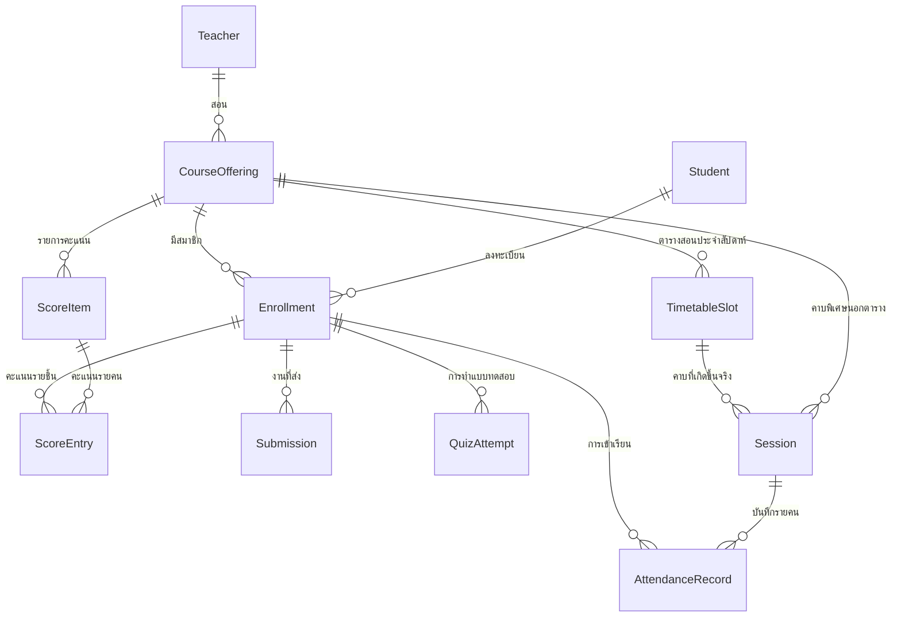
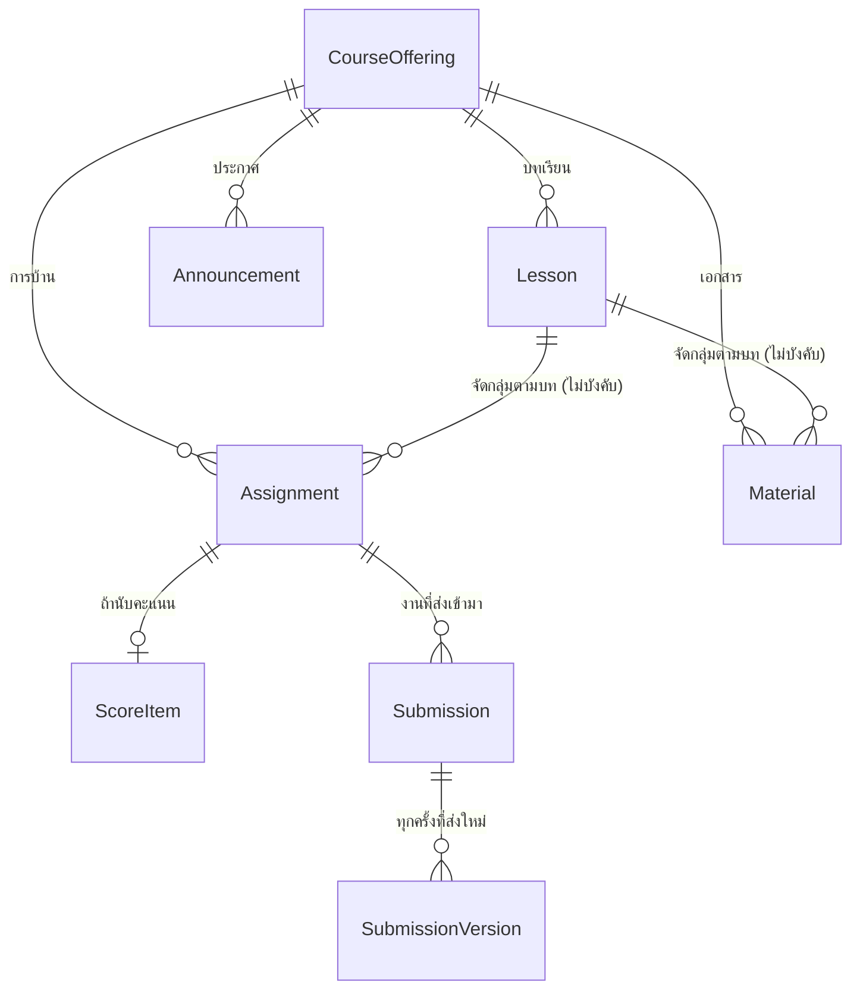
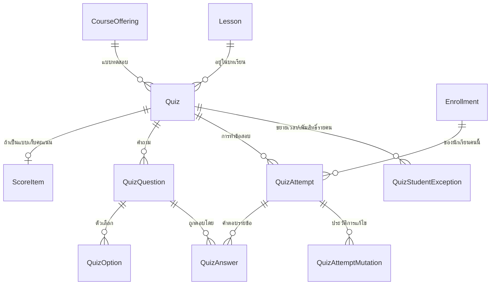
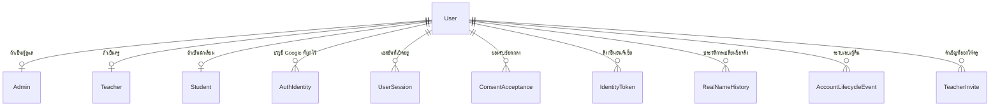
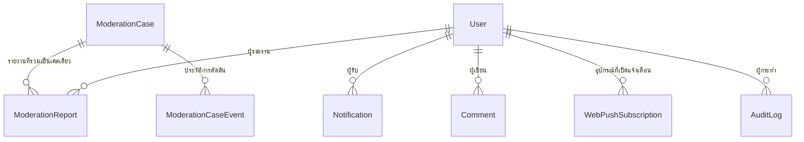

# Data Model — โครงสร้างฐานข้อมูล

**แหล่งความจริงคือ [`prisma/schema.prisma`](../prisma/schema.prisma) เสมอ** เอกสารนี้เป็นแผนที่ของไฟล์นั้น
สร้างจาก schema จริง ไม่ใช่คำอธิบายที่พิมพ์ตามความทรงจำ ถ้าสองอย่างไม่ตรงกัน schema ถูก

ปัจจุบัน: **41 ตาราง · 21 enum** · PostgreSQL บน Neon

---

## เปิดดูฐานข้อมูล

มีสองอย่างที่คนมักหมายถึงคนละแบบเวลาพูดว่า "ขอดู database หน่อย"

### 1. ดูข้อมูลจริงในตาราง — Prisma Studio

เปิดหน้าเว็บให้คลิกดูทุกตารางทุกแถวได้ที่ `localhost:5555`

```bash
pnpm db:studio:qa
```

ตัวนี้ชี้ไปที่ **ฐานข้อมูล QA** ซึ่งเป็นตัวที่ควรใช้ตอนเปิดให้คนอื่นดู

```bash
pnpm db:studio
```

ตัวนี้ชี้ไปที่ `DATABASE_URL` ซึ่ง **คือฐานข้อมูล Production ตัวจริง** — Prisma Studio
แก้และลบแถวได้ทุกแถวที่มันแสดง เปิดตัวนี้เฉพาะตอนจำเป็นและตอนที่ไม่มีใครยืนดูอยู่ข้าง ๆ

### 2. ดูโครงสร้าง — ไฟล์นี้

แผนภาพข้างล่างแสดงว่ามีตารางอะไร เชื่อมกันยังไง และทำไมถึงออกแบบแบบนั้น
ถ้าเปิดใน GitHub แผนภาพจะ render ให้อัตโนมัติ ไม่ต้องติดตั้งอะไร

---

## สองเรื่องที่ต้องรู้ก่อน แล้วจะอ่าน schema นี้ออกทั้งหมด

### กุญแจที่ 1 — ทุกอย่างที่เป็น "ผลการเรียน" แขวนอยู่กับ `Enrollment` ไม่ใช่ `Student`

`Enrollment` แปลว่า *นักเรียนคนนี้ ในวิชานี้* การเข้าเรียน คะแนน งานที่ส่ง และการทำแบบทดสอบ
ล้วนชี้มาที่ตารางนี้ ไม่มีอันไหนชี้ไปที่ `Student` ตรง ๆ เลย

ผลที่ตามมา:

- นักเรียนคนเดียวเรียน 5 วิชา = มีบัญชีการเรียน 5 ชุดที่แยกกันสนิท ไม่มีการรวมข้ามวิชา
- การนำนักเรียนออกจากห้อง (`Enrollment.removedAt`) ไม่ทำให้คะแนนหรืองานเก่าหายไป
  เพราะแถวยังอยู่ แค่ถูกทำเครื่องหมายว่าไม่ active
- ไม่มีทางเผลอ query คะแนนข้ามวิชาโดยไม่ตั้งใจ เพราะต้องผ่าน `Enrollment` เสมอ

### กุญแจที่ 2 — มีสองตารางที่ตั้งใจไม่มีความสัมพันธ์ตรง

`FileAttachment` และ `Comment` ใช้คู่ `ownerType` + `ownerId` แทน foreign key จริง
ไฟล์หนึ่งไฟล์จึงแนบได้กับทั้งการบ้าน เอกสาร ประกาศ หรืองานที่นักเรียนส่ง โดยไม่ต้องมี
คอลัมน์แยกทุกแบบ — แลกกับการที่ฐานข้อมูลบังคับความถูกต้องให้ไม่ได้ ต้องบังคับในโค้ดแทน

---

## แกนหลัก — จากครูถึงผลการเรียน



อ่านจากซ้ายไปขวา: ครูเป็นเจ้าของวิชา วิชามีสมาชิก และสมาชิกแต่ละคนสะสมสี่อย่าง —
การเข้าเรียน คะแนน งานที่ส่ง และการทำแบบทดสอบ

`Session` คือคาบที่เกิดขึ้นจริง ส่วน `TimetableSlot` คือตารางสอนประจำที่ใช้สร้างคาบขึ้นมา
คาบพิเศษที่ไม่ได้อยู่ในตารางก็สร้างได้ จึงมีเส้นตรงจาก `CourseOffering` มาที่ `Session` ด้วย

---

## เนื้อหาในวิชา



การบ้านและเอกสารเป็นของวิชาเสมอ ส่วนการผูกกับบทเรียนเป็นทางเลือก — ของที่สร้างก่อนจะมี
ระบบบทเรียนจึงยังอยู่ได้โดยไม่ต้องย้าย

`SubmissionVersion` คือสิ่งที่ทำให้ประวัติการส่งงานไม่หาย นักเรียนส่งใหม่กี่ครั้งก็เก็บครบทุกครั้ง
ไม่ใช่การเขียนทับของเดิม

---

## แบบทดสอบ



---

## ตัวตนและบัญชีผู้ใช้



`User` เก็บสิ่งที่ใช้ล็อกอิน ส่วนชื่อจริงอยู่ใน `Admin` / `Teacher` / `Student` แยกตามบทบาท
ผู้ใช้หนึ่งคนมีบทบาทเดียว และ `User.id` เป็นตัวเชื่อมทุกอย่างในระบบ

---

## ส่วนที่ตัดขวางทุกโดเมน



`Comment` `FileAttachment` และ `Notification` ไม่มีเส้นไปหาสิ่งที่มันแขวนอยู่ เพราะใช้
`ownerType`/`ownerId` (ดูกุญแจที่ 2) — แผนภาพจึงแสดงได้แค่ความสัมพันธ์กับ `User`

---

## ตารางทั้งหมด แยกตามกลุ่ม

| กลุ่ม | ตาราง | หน้าที่ |
| --- | --- | --- |
| **ตัวตน** | `User` | บัญชีผู้ใช้ ตัวเชื่อมกลางของทั้งระบบ |
| | `Admin` `Teacher` `Student` | ชื่อจริงและข้อมูลตามบทบาท หนึ่งคนหนึ่งบทบาท |
| | `AuthIdentity` | บัญชี Google ที่ผูกกับ User |
| | `UserSession` | เซสชันที่ยัง active ใช้เพิกถอนได้ |
| | `TeacherInvite` | คำเชิญครูแบบผูกอีเมล ใช้ครั้งเดียว |
| | `ConsentAcceptance` | การยอมรับข้อตกลงและนโยบายแต่ละเวอร์ชัน |
| | `IdentityToken` | ลิงก์ยืนยันอีเมล / รีเซ็ตรหัสผ่าน |
| | `RealNameHistory` | ประวัติการเปลี่ยนชื่อจริง |
| | `AccountLifecycleEvent` | ระงับ ลบ กู้คืนบัญชี |
| **วิชา** | `CourseOffering` | วิชาที่ครูเปิดสอน — เป็นขอบเขตของสิทธิ์แทบทุกอย่าง |
| | `Enrollment` | นักเรียนคนนี้ในวิชานี้ — จุดยึดของผลการเรียนทั้งหมด |
| **เช็คชื่อ** | `TimetableSlot` | ตารางสอนซ้ำรายสัปดาห์ |
| | `Session` | คาบเรียนที่เกิดขึ้นจริง |
| | `AttendanceRecord` | สถานะการเข้าเรียนรายคนรายคาบ |
| **คะแนน** | `ScoreItem` | รายการคะแนน เช่น สอบกลางภาค |
| | `ScoreEntry` | คะแนนของนักเรียนหนึ่งคนในรายการนั้น |
| **เนื้อหา** | `Lesson` | บทเรียนที่ใช้จัดกลุ่มเนื้อหา |
| | `Assignment` | การบ้าน |
| | `Material` | เอกสารประกอบ |
| | `Announcement` | ประกาศ |
| **งานที่ส่ง** | `Submission` | การส่งงานของนักเรียนหนึ่งคนต่อการบ้านหนึ่งชิ้น |
| | `SubmissionVersion` | เนื้อหาที่ส่งแต่ละครั้ง เก็บครบทุกรอบ |
| **แบบทดสอบ** | `Quiz` `QuizQuestion` `QuizOption` | ตัวข้อสอบและตัวเลือก |
| | `QuizAttempt` `QuizAnswer` | การทำข้อสอบและคำตอบรายข้อ |
| | `QuizAttemptMutation` | ประวัติการแก้ไขการทำข้อสอบ |
| | `QuizStudentException` | ขยายเวลาหรือเพิ่มจำนวนครั้งให้รายคน |
| **การโต้ตอบ** | `Comment` | คอมเมนต์ แบบทั้งห้องเห็น หรือแบบครู↔นักเรียน |
| | `Notification` | แจ้งเตือนในแอป หนึ่งแถวต่อผู้รับต่อเหตุการณ์ |
| **ตรวจสอบเนื้อหา** | `ModerationCase` | เคสที่รวมรายงานหลายอันของเป้าหมายเดียวกัน |
| | `ModerationReport` | รายงานแต่ละครั้งจากผู้ใช้ |
| | `ModerationCaseEvent` | ประวัติการดำเนินการในเคส |
| **พื้นฐาน** | `FileAttachment` | ไฟล์แนบ เก็บจริงบน R2 เข้าถึงผ่านลิงก์มีอายุเท่านั้น |
| | `WebPushSubscription` | อุปกรณ์ที่เปิดรับแจ้งเตือน |
| | `AuditLog` | บันทึกการกระทำที่ต้องตรวจสอบย้อนหลังได้ |
| | `RateLimitBucket` | จำกัดอัตราการเรียกใช้ |
| | `GuideTourCompletion` | ผู้ใช้ดูคำแนะนำการใช้งานแล้วหรือยัง |

---

## การเปลี่ยนโครงสร้าง

- โครงสร้างปัจจุบันสร้างจาก migration เดียวคือ
  [`prisma/migrations/00000000000000_squashed_baseline`](../prisma/migrations/00000000000000_squashed_baseline)
  ซึ่งสร้างทั้ง 41 ตารางจากฐานว่างได้
- [`prisma/raw-sql/0001-notification-partial-unique.sql`](../prisma/raw-sql/0001-notification-partial-unique.sql)
  คือ index ที่ Prisma เขียนเองไม่ได้ ใช้กันการแจ้งเตือนซ้ำ
- อย่ารัน `prisma migrate dev` หรือ `db push` โดยไม่ตั้งใจ — `DATABASE_URL` ในเครื่องคือ Production
  ดู [DEPLOY.md](./DEPLOY.md) และ [DATA-SAFETY-RUNBOOK.md](./DATA-SAFETY-RUNBOOK.md)
